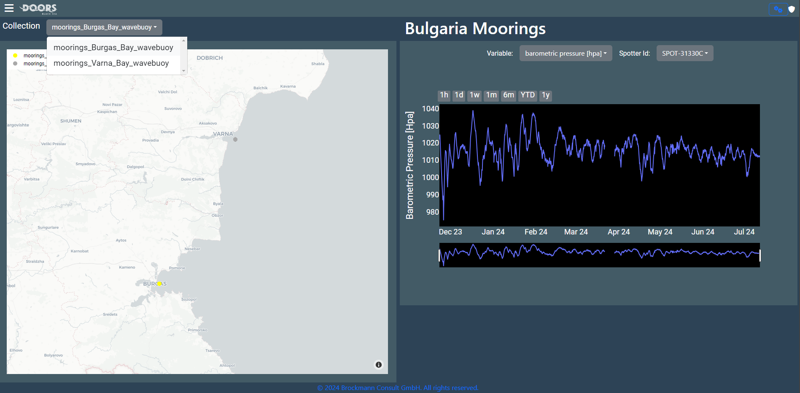
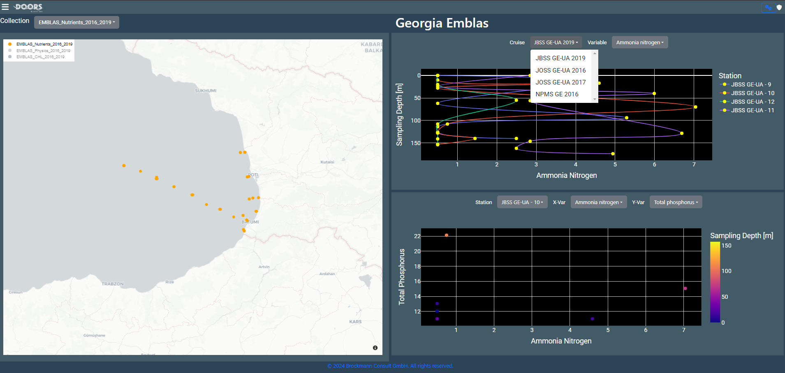
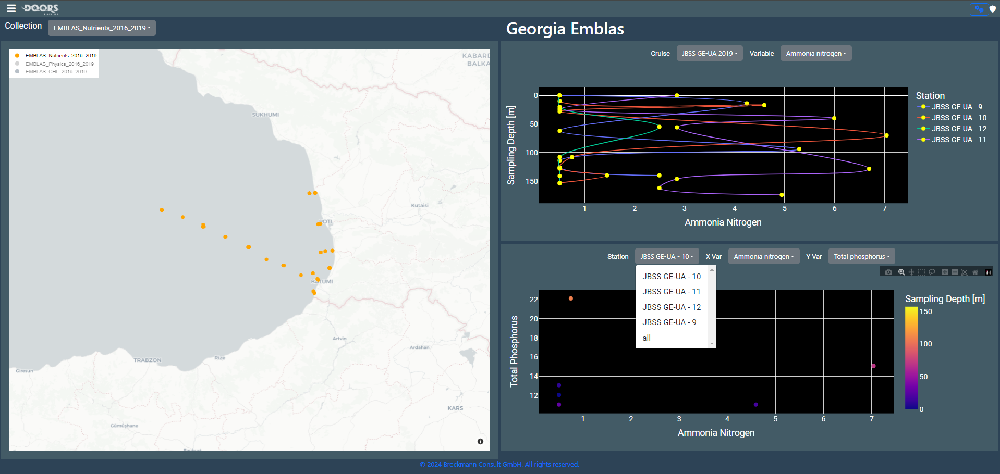
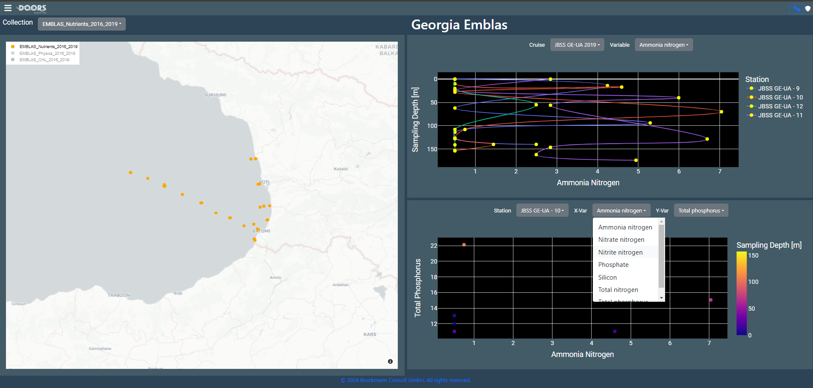

Dashboard App
==========

The Dashboard Application offers users an accessible and visually appealing interface 
for browsing and analyzing varied datasets using interactive visualizations. 

Functionality
=============

The dashboard provides access to a range of functions such as weather forecasts, time 
series, scatter plots, point and line graphs, and trajectory displays. It allows for 
faster load times and smoother user interactions, benefiting the overall experience 
for users.

<!--  -->

The dashboard visualizes data from the datasets on top of a basemap.
For zooming hover the mouse on map and the buttons in the top right corner will show 
up or the zooming function of your computer mouse.In the upper left corner a
corresponding legend to the mapped collection is available.

<!--  -->

To view different/single collections on map using `legend` double-click on one of 
collection in the `legend` and only that collection will be shown on map amd other 
will be disbaled. Similary to get back all the collection points on map  then again 
double on earlier selected collection. 

<!--  -->

To change the map theme click on the `Settings` button symbol. `Carto Positron` is 
default map theme applied.

<!--  -->

An individual dashboard can have different collections which you can select 
via the drop-down menu `Collection`. If you choose a collection, the graphs will update 
to display the correct data for that selection. 

<!--  -->

If more than one variable is available within a selected collection, 
you may change the variable by using the drop-down menu `Variable` on the right side 
of dashboard in visualization area.

<!--  -->

To view data for certain time periods, use the `Time range` option at the top of the 
graph. This will allow you to view selective data for the specified variable. The 
`Time Slider` at the bottom of the graph allows for seeing various periods of data by 
moving it left or right.

<!--  -->

The visualisation depends on the data in collection and use case so for some 
collections the visualisation will be different like line plot and point plot. 

<!--  -->

If more than one cruise is available within a selected collection, 
you may change the cruise by using the drop-down menu `Cruise` on the right side 
of dashboard in visualization area.

<!--  -->

If more than one station is available within a selected cruise, 
you may change the station by using the drop-down menu `Station` on the right side 
of dashboard for scatter point plot graph in visualization area. 

<!--  -->

The selected station from the dropdown will be highlighted on the map to get an idea
about the station location. 

<!--  -->

To adjust the variables displayed on the scatter plot, use the 'X-Var' drop-down menu 
located on the right side of the dashboard above point plot. This menu allows you to 
select the variable you want to display on the X-axis. Once you make a selection, the 
scatter plot will automatically update to reflect the new comparison.

<!--  -->

Similarly, for y variable select a variable from dropdown `Y-Var` on the right side 
of dashboard above point plot graph.

<!--  -->

When hovering over the on graph area on right side of the dashboard, the menu for 
graph appears. Download the graph as PNG by clicking on the camera button. The axis 
can be zoomed in using zoom functionality. Zoom button are provided to zoom in and 
out on the graph. 

<!--  -->
