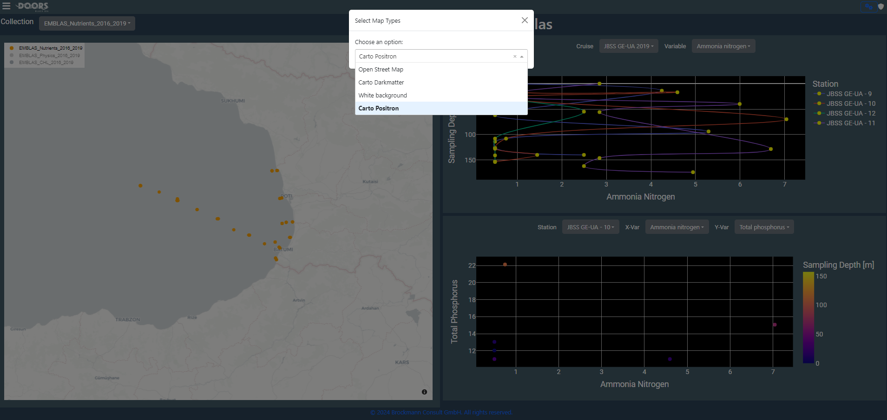

Dashboards App
==============

The Dashboards Application offers users an accessible and appealing interface 
for browsing and analyzing varied datasets using interactive visualizations. 
The datasets that can be visualized with the Dashboards App are vector data, such as 
in-situ measurements.
Any such dataset within the Dashboards App is called a collection. 

The Dashboards Application is a collection of several dashboards.
Each dashboard consists of different elements - so far, each one at least of a map - 
and may handle different collections.
Other elements are typically plots that may help to gain further insight into a
collection.
The overview button in the top left brings up the available dashboards.

<!--  -->

Functionality
=============

The Dashboards App provides access to a range of functions such as weather forecasts, 
time series, scatter plots, point and line graphs, and trajectory displays. 
It allows for fast load times and smooth interactions, benefiting the overall experience 
for users.

The Base Map
------------

The Map is the one element that you may find in every dashboard.
It will either show locations from elements of one or more collections, 
or other specifically denoted locations.
To zoom, either use the buttons in the top right bar of the map (becomes visible on 
hovering) or your mouse wheel. 

<!--  -->

A dashboard visualizes data from the datasets on top of a basemap.
For zooming hover the mouse on map and the buttons in the top right corner will show 
up or the zooming function of your computer mouse.
In the upper left corner a legend to the mapped collection is available. 
To toggle the display of collections on the map, click a collection's name in the 
upper left corner.
Double-clicking will cause that only the selected collection is shown, another 
double-click brings up the other collections again.

<!--  -->

To change the map theme click on the `Settings` button on the top right of the app. 
`Carto Positron` is the default map theme applied.

<!--  -->

Plots
-----

When the dashboard offers also plots in addition to the map, you can switch between
collections via the drop-down menu `Collection`. 
If you choose a collection, the graphs will update to display the correct data for 
that selection. 

<!--  -->

If more than one variable is available within a selected collection, 
you may change the variable by using the drop-down menu `Variable` on the right side 
of dashboard in visualization area.

<!--  -->

In the time range plot, to view data for certain time periods, use the `Time range` 
option at the top of the graph. 
This will allow you to view selective data for the specified variable. 
The `Time Slider` at the bottom of the graph allows for seeing various periods of data 
by moving it left or right.

<!--  -->

Some dashboards will offer more than one plot, like this one who offers a line and a
scatter plot, to better allow to explore the data.

<!--  -->

If more than one cruise is available for a collection, 
you may change the cruise by using the drop-down menu `Cruise`.

<!--  -->

If more than one station is available for a selected cruise, 
you may change the station by using the drop-down menu `Station`. 

<!--  -->

The selected station will be highlighted on the map. 
Likewise, if you select a location on the map, the plots will be updated accordingly. 

<!--  -->

To adjust the variables displayed on the scatter plot, use the `X-Var` and `Y-Var` 
drop-down menus.
These allow you to select the variables you want to display on the X- and Y-axis, 
respectively. 
Once you make a selection, the scatter plot will update.

<!--  -->

For each plot, there is a button bar in the top right. 
You can download a graph as png by clicking on the camera button. 
There is also functionality to zoom in and out, reset axes, and to pan.

<!--  -->

